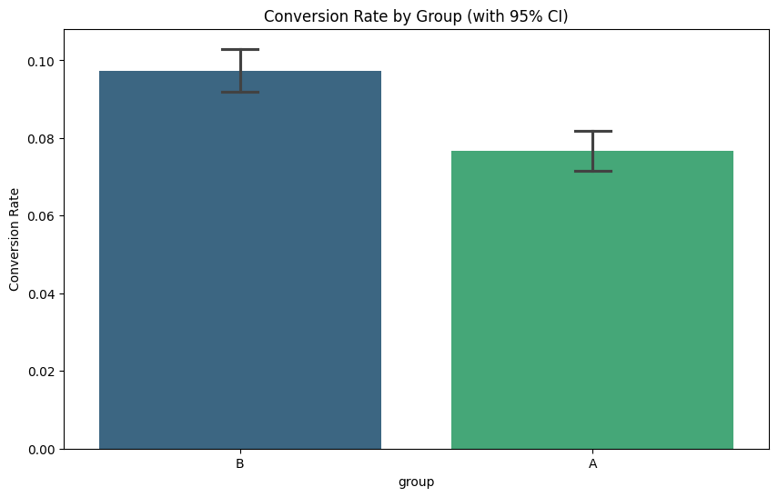

# 📈 Social Proof 기반 구독 서비스 전환율(CVR) 최적화 A/B 테스트

> **"데이터 시뮬레이션을 통한 가설 검증부터 비즈니스 임팩트 산출까지"**
> 
> 본 프로젝트는 단순한 데이터 분석을 넘어, 통계적 설계(Power Analysis)에 기반한 실험 환경을 구축하고 비즈니스 의사결정을 위한 정량적 근거를 도출하는 과정을 담고 있습니다.

---

## 1. Executive Summary (핵심 요약)

* **배경**: 구독 결제 단계의 이탈률 개선을 위해 '사회적 증거(리뷰/별점)' 도입 가설 수립.
* **실험 설계**: 95% 신뢰수준 확보를 위한 샘플 사이즈 도출($N \approx 20,000$) 및 현실적 노이즈(주말 효과, 기기 편향)를 반영한 데이터 생성.
* **분석 결과**: 실험군(B)의 전환율이 대조군(A) 대비 **약 2.1%p 상승** (상대적 $26.9\%$ 개선).
* **통계 검정**: 카이제곱 검정 결과 **$P$-value < 0.0001**로 가설의 유효성 강력 지지.
* **경제적 가치**: 개선안 적용 시 **연간 약 1.48억 원**의 추가 매출 기여 예상.

---

## 2. 비즈니스 문제 정의 및 가설

### Problem Statement
사용자는 결제 직전 단계에서 서비스의 가치에 대한 심리적 불안감을 느끼며, 이는 높은 이탈률로 이어집니다. 현재의 기능 위주 랜딩 페이지는 이러한 불안을 해소할 '신뢰 장치'가 부족합니다.

### Hypothesis
"랜딩 페이지 하단에 실제 사용자 리뷰와 평점 섹션을 추가하면, 사회적 증거 효과로 인해 사용자 신뢰도가 향상되어 구독 전환율($CVR$)이 **상대적으로 12% 이상 상승**할 것이다."

---

## 3. 실험 설계 (Experimental Design)

데이터 분석가로서 실험의 무결성을 위해 아래와 같은 통계적 절차를 준수했습니다.

### 사전 통계 설계 (Power Analysis)
실험 전, 제1종 오류($\alpha=0.05$)와 제2종 오류($\beta=0.2$)를 통제하기 위해 필요한 최소 샘플 사이즈를 산출했습니다.
* **Baseline CVR**: $10\%$
* **Minimum Detectable Effect (MDE)**: 상대적 $12\%$
* **결과**: 그룹당 약 $10,323$명, 총 **$20,646$명**의 샘플 확보 필요.

### 데이터 시뮬레이션 (Realism)
실제 비즈니스 환경과 유사한 분석을 위해 다음과 같은 '현실적 변수'를 데이터에 반영했습니다.
* **주말 효과**: 주말 유입 유저의 낮은 전환 의지 반영 (전환율 $-3\%p$).
* **기기 편향**: 모바일 유저의 결제 복잡성에 따른 낮은 전환율 반영 (전환율 $-2\%p$).

---

## 4. 분석 및 검정 결과

### 전환율 비교 시각화
대조군(A)과 실험군(B)의 전환율을 비교한 결과, 실험군에서 뚜렷한 성과 향상이 관찰되었습니다.
* **Group A (Control)**: $7.66\%$
* **Group B (Variant)**: $9.72\%$

### 통계적 가설 검정 (Chi-Square Test)
두 그룹 간의 전환율 차이가 우연에 의한 것인지 검증했습니다.
* **카이제곱 통계량**: $27.4226$
* **$P$-value**: $0.0000$ (유의수준 $0.05$ 하에서 귀무가설 기각)
* **해석**: 본 실험의 결과는 통계적으로 매우 견고하며, 개선안 도입 시 전환율 상승 효과를 신뢰할 수 있습니다.

---

## 5. 비즈니스 임팩트 (ROI Analysis)

실험 결과를 비즈니스의 언어인 **'수익'**으로 환산했습니다.

| 지표 | 산출 근거 | 결과값 |
| :--- | :--- | :--- |
| **월간 예상 추가 매출** | 월 유입 $30,000$명 $\times$ $CVR$ 상승분($2.06\%p$) $\times$ 단가($20,000$원) | **$12,380,122$원** |
| **연간 누적 기대 매출** | 월 추가 매출 $\times$ $12$개월 | **$148,561,465$원** |

> **의사결정 제언**: 실험군(B) 도입 시 연간 약 **1.5억 원** 규모의 추가 매출 기여가 예상되므로, 해당 개선안의 전면 배포를 강력히 권고합니다.

---

## 🛠️ 기술 스택 (Tech Stack)
- **Language**: Python 3.x
- **Library**: `Pandas`, `NumPy`, `SciPy` (Statistical Testing), `Statsmodels` (Power Analysis), `Matplotlib`, `Seaborn` (Visualization)